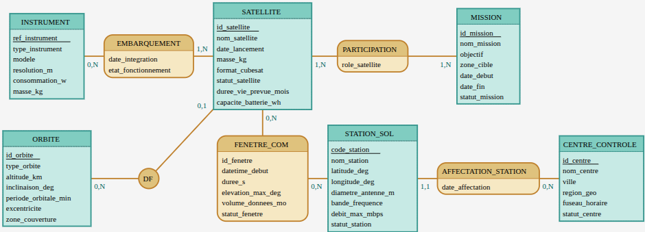

# NanoOrbit Phase 1 – Modèle Logique de Données

## 1. Objet du document

Ce document décrit le Modèle Logique de Données (MLD) relationnel dérivé du MCD NanoOrbit (constellation de CubeSats) et conforme au cahier des charges de la Phase 1. Il précise pour chaque table : les attributs, la clé primaire (PK), les clés étrangères (FK) et les principales contraintes DDL (NOT NULL, UNIQUE, CHECK).

## 2. Architecture du Modèle (MCD)

Le modèle repose sur les entités et associations suivantes, couvrant l'ensemble des règles de gestion (RG) du projet :



*Note : L'image ci-dessus représente l'articulation entre les Orbites, Satellites, Instruments, Centres de contrôle, Stations au sol et Missions.*

---

## 3. MLD Relationnel Détaillé

### 3.1 Table ORBITE  
Structure le plan orbital des satellites.

```text
ORBITE (
  id_orbite              PK,
  type_orbite,
  altitude_km,
  inclinaison_deg,
  periode_orbitale_min,
  excentricite,
  zone_couverture
)
```

- **PK** : `id_orbite` (clé technique auto‑incrémentée).
- **Contraintes** :
  - `UNIQUE(altitude_km, inclinaison_deg)` : respect de RG‑O02 (unicité du plan orbital).
  - Tous les attributs sont **NOT NULL**.

### 3.2 Table SATELLITE  
Référence les CubeSats de la constellation.

```text
SATELLITE (
  id_satellite           PK,
  nom_satellite,
  date_lancement,
  masse_kg,
  format_cubesat,
  statut_satellite,
  duree_vie_prevue_mois,
  capacite_batterie_wh,
  id_orbite              FK -> ORBITE(id_orbite)
)
```

- **PK** : `id_satellite` (code alphanumérique type `SAT-001`, immuable après mise en orbite – RG‑S01, géré applicativement).
- **FK** : `id_orbite` → `ORBITE(id_orbite)` (orbite courante – RG‑S02, RG‑O01, RG‑O03).
- **Contraintes** :
  - `id_orbite` est **NULLABLE** afin de permettre l’existence d’orbites pré‑planifiées sans satellite affecté (RG‑O03).
  - Tous les autres attributs sont **NOT NULL**.
  - `statut_satellite` : `CHECK ( 'Opérationnel', 'En veille', 'Défaillant', 'Désorbité' )`.

### 3.3 Table INSTRUMENT  
Catalogue des instruments scientifiques exploités.

```text
INSTRUMENT (
  ref_instrument         PK,
  type_instrument,
  modele,
  resolution_m,
  consommation_w,
  masse_kg
)
```

- **PK** : `ref_instrument` (référence constructeur unique – RG‑I01).
- **Contraintes** :
  - `resolution_m` est **NULLABLE** (ex. récepteur AIS – RG précisée dans le CDC).
  - Tous les autres attributs sont **NOT NULL**.
  - `type_instrument` : `CHECK ( 'Caméra optique', 'Infrarouge', 'Récepteur AIS', 'Spectromètre' )`.

### 3.4 Table EMBARQUEMENT  
Association N:N entre Satellites et Instruments (RG‑S03, RG‑S04, RG‑I02).

```text
EMBARQUEMENT (
  id_satellite           PK, FK -> SATELLITE(id_satellite),
  ref_instrument         PK, FK -> INSTRUMENT(ref_instrument),
  date_integration,
  etat_fonctionnement
)
```

- **PK composite** : (`id_satellite`, `ref_instrument`).
- **FK** :
  - `id_satellite` → `SATELLITE(id_satellite)`,
  - `ref_instrument` → `INSTRUMENT(ref_instrument)`.
- **Contraintes** :
  - Tous les attributs sont **NOT NULL**.
  - `etat_fonctionnement` : `CHECK ( 'Nominal', 'Dégradé', 'Hors service' )`.

---

### 3.5 Tables CENTRE_CONTROLE, STATION_SOL et AFFECTATION_STATION  
Gestion de l'infrastructure sol et rattachement aux centres.

```text
CENTRE_CONTROLE (
  id_centre              PK,
  nom_centre,
  ville,
  region_geo,
  fuseau_horaire,
  statut
)

STATION_SOL (
  code_station           PK,
  nom_station,
  latitude_deg,
  longitude_deg,
  diametre_antenne_m,
  bande_frequence,
  debit_max_mbps,
  statut_station
)

AFFECTATION_STATION (
  id_centre              PK, FK -> CENTRE_CONTROLE(id_centre),
  code_station           PK, FK -> STATION_SOL(code_station),
  date_affectation
)
```

- **CENTRE_CONTROLE**
  - **PK** : `id_centre` (NUMBER auto‑incrémenté).
  - Tous les attributs sont **NOT NULL**.
  - `statut` : `CHECK ( 'Actif', 'Inactif' )`.

- **STATION_SOL**
  - **PK** : `code_station` (ex. `GS-TLS-01`).
  - Tous les attributs sont **NOT NULL**.
  - `bande_frequence` : `CHECK ( 'UHF', 'S', 'X', 'Ka' )`.
  - `statut_station` : `CHECK ( 'Active', 'Maintenance', 'Inactive' )`.
  - `latitude_deg` et `longitude_deg` **NOT NULL** pour RG‑G01.

- **AFFECTATION_STATION**
  - **PK composite** : (`id_centre`, `code_station`).
  - **FK** : vers `CENTRE_CONTROLE` et `STATION_SOL`.
  - `date_affectation` **NOT NULL**.
  - Implémente RG‑G04 (chaque station rattachée à un centre, un centre supervise plusieurs stations).

---

### 3.6 Tables MISSION et PARTICIPATION  
Objectifs scientifiques et déploiement des satellites.

```text
MISSION (
  id_mission             PK,
  nom_mission,
  objectif,
  zone_cible,
  date_debut,
  date_fin,
  statut_mission
)

PARTICIPATION (
  id_satellite           PK, FK -> SATELLITE(id_satellite),
  id_mission             PK, FK -> MISSION(id_mission),
  role_satellite
)
```

- **MISSION**
  - **PK** : `id_mission` (code type `MSN-XXX-AAAA`).
  - `date_debut` **NOT NULL**, `date_fin` **NULLABLE** (RG‑M01).
  - Tous les autres attributs sont **NOT NULL**.
  - `statut_mission` : `CHECK ( 'Active', 'Terminée' )`.

- **PARTICIPATION**
  - **PK composite** : (`id_satellite`, `id_mission`).
  - **FK** : vers `SATELLITE` et `MISSION`.
  - Tous les attributs sont **NOT NULL**.
  - `role_satellite` porte la RG‑M03 (Imageur principal, relais, secours, etc.).

---

### 3.7 Table FENETRE_COM  
Journalisation des fenêtres de communication.

```text
FENETRE_COM (
  id_fenetre             PK,
  datetime_debut,
  duree_s,
  elevation_max_deg,
  volume_donnees_mo,
  statut_fenetre,
  id_satellite           FK -> SATELLITE(id_satellite),
  code_station           FK -> STATION_SOL(code_station)
)
```

- **PK** : `id_fenetre` (NUMBER auto‑incrémenté).
- **FK** :
  - `id_satellite` → `SATELLITE(id_satellite)`,
  - `code_station` → `STATION_SOL(code_station)` (RG‑F01).
- **Contraintes** :
  - `datetime_debut`, `duree_s`, `elevation_max_deg`, `statut_fenetre`, `id_satellite`, `code_station` sont **NOT NULL**.
  - `volume_donnees_mo` est **NULLABLE** : `NULL` pour une fenêtre Planifiée, renseigné uniquement si `statut_fenetre = 'Réalisée'` (RG‑F05).
  - `duree_s` : `CHECK (duree_s BETWEEN 1 AND 900)` (RG‑F04).

> RG‑F02 et RG‑F03 (pas de chevauchement pour un même satellite / une même station) seront implémentées par des triggers `BEFORE INSERT/UPDATE` en Phase 2.

---

[Précédent](03-classification-regles-gestion.md) | [Phase 1](README.md) | [Source Mocodo](mcd_nanoorbit.mocodo) | [Données de test](../../donnees/README.md)